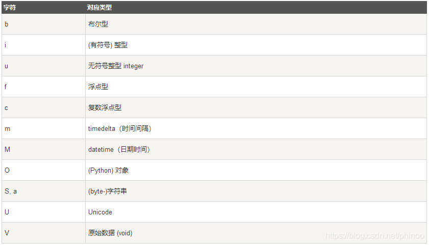

# 1. NumPy基础

---

## 1.1 Ndarray 对象

NumPy 最重要的一个特点是其 N 维数组对象 ndarray，该对象是一个快速而灵活的大数据集容器，描述相同数据类型的元素集合，以 0 下标为开始进行集合中元素的索引。

```python
numpy.array(object, dtype = None, copy = True, order = None, subok = False, ndmin = 0)
```

## 1.2 NumPy 数据类型

numpy 支持的数据类型(dtype)比 Python 内置的类型要多很多，基本上可以和 C 语言的数据类型对应上，其中部分类型对应为 Python 内置的类型。

| 名称 | 描述 |
|--|--|
| bool_  | 布尔型数据类型（True 或者 False） |
| int_ | 默认的整数类型（类似于 C 语言中的 long，int32 或 int64） |
| intc  |与 C 的 int 类型一样，一般是 int32 或 int 64 |
| intp  |用于索引的整数类型（类似于 C 的 ssize_t，一般情况下仍然是 int32 或 int64） |
| int8  |字节（-128 to 127） |
| int16  |整数（-32768 to 32767） |
| int32 | 整数（-2147483648 to 2147483647） |
| int64 | 整数（-9223372036854775808 to 9223372036854775807） |
| uint8 | 无符号整数（0 to 255） |
| uint16 | 无符号整数（0 to 65535） |
| uint32 | 无符号整数（0 to 4294967295） |
| uint64 | 无符号整数（0 to 18446744073709551615） |
| float_  |float64 类型的简写 |
| float16 | 半精度浮点数，包括：1 个符号位，5 个指数位，10 个尾数位 |
| float32 | 单精度浮点数，包括：1 个符号位，8 个指数位，23 个尾数位 |
| float64 | 双精度浮点数，包括：1 个符号位，11 个指数位，52 个尾数位 |
| complex_ | complex128 类型的简写，即 128 位复数 |
| complex64 | 复数，表示双 32 位浮点数（实数部分和虚数部分） |
| complex128 | 复数，表示双 64 位浮点数（实数部分和虚数部分） |

字节顺序是通过对数据类型预先设定”<“或”>”来决定的。”<“意味着小端法(最高有效字节在最前面的方式称为大端法)。”>”意味着大端法(最低有效字节在最前面的方式成为小端法)。



## 1.3 Numpy 数据类型转换

numpy中的数据类型转换，不能直接改原数据的dtype，只能用函数astype()。

```python
import numpy as np
a=np.random.random (4)
a.dtype ="float32"
```

## 1.4 NumPy 数组属性

|属性|说明|
|--|--|
|ndarray.ndim|秩，即轴的数量或维度的数量
|ndarray.shape|数组的维度，对于矩阵,n行m列
|ndarray.size|数组元素的总个数，相当于 shape中n*m的值
|ndarray.dtype|ndarray对象的元素类型
|ndarray.itemsize| ndarray对象中每个元素的大小，以字节为单位
|ndarray.flags|ndarray对象的内存信息
|ndarray.real|ndarray元素的实部
|ndarray.imag|ndarray元素的虚部
|ndarray.data|包含实际数组元素的缓冲区，由于一般通过数组的索引获取元素，所以通常不需要使用这个属性

# 2. NumPy 创建数组

---
创建数组最简单的方法就是使用numpy.array函数,它接收一切序列型的对象（包括其他数组），然后产生一个新的含有传入数据的Numpy数组。也可以使用numpy.zeros，numpy.empty，numpy.ones，numpy.arange，numpy.eys等创建数组。

```python
import numpy as np
ndarray1 = np.array([1, 2, 3, 4])
ndarray2 = np.array(list('abcdefg'))
ndarray3 = np.array([[11, 22, 33, 44], [10, 20, 30, 40]])
```

## 2.1 numpy.zeros和zeros_like创建数组

数组元素默认值是0. 注意:zeros_linke函数只是根据传入的ndarray数组的shape来创建所有元素为0的数组，**并不是拷贝源数组中的数据**

```python
numpy.zeros(shape, dtype = float, order = 'C')
```

|参数|描述
|--|--|
|shape|数组形状
|dtype|数据类型,可选
|order|有"C"和F"两个选项分别代表，行优先和列优先，在计算机内存中的存储元素的顺序

**numpy.empty和empty_like、numpy.ones和ones_like创建数组，用法相同**

## 2.2 numpy.fromiter

numpy.fromiter 方法从可迭代对象中建立 ndarray 对象，返回一维数组。

```python
numpy.fromiter(iterable, dtype, count=-1)
```

|参数|描述
|--|--|
|iterable|可迭代对象
|dtype|数据类型,可选
|count|读取的数据数量，默认为-1，读取所有数据
